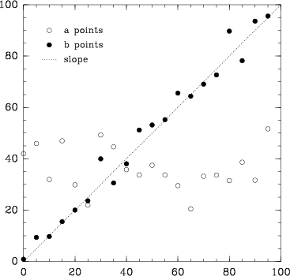

## Your First Plot with Biggles

Biggles lets you build plots using a simple, object-oriented interface. You declare [containers](guide/containers.md)
and then add [components](guide/components.md) to them. Let's make out first plot with biggles!

First, you instantiate a container. In this example, we will use a [`FramedPlot`](guide/containers.md#framedplot).

```python
import biggles

p = biggles.FramedPlot()
```

We can set axis ranges, aspect ratios (and other properties) of the `FramedPlot` using its attributes:

```python
p.xrange = 0, 100
p.yrange = 0, 100
p.aspect_ratio = 1
```

Now, let's make some data to plot:

```python
import numpy
x = numpy.arange(0, 100, 5)
yA = numpy.random.normal(40, 10, (len(x),))
yB = x + numpy.random.normal(0, 5, (len(x),))
```

We can add this data to the plot by instantiating [`Points`](guide/components.md#points-and-polygons) objects:

```python
a = biggles.Points(x, yA, type="circle")
a.label = "a points"

b = biggles.Points(x, yB)
b.label = "b points"
b.style(type="filled circle")
```

Notice here we have set labels for the points and have used the `style` method to set the style of the points. See
the documentation to see all of the [style options](guide/style.md).

Let's instantiate a [`Slope`](guide/components.md#lines) component to use for data annotation:

```python
l = biggles.Slope(1, type="dotted")
l.label = "slope"
```

Further, we would like a [`PlotKey`](guide/components.md#plot-keys-and-labels) for our labels:

```python
k = biggles.PlotKey(.1, .9)
k += a, b, l
```

Finally, let's add these components to the plot, display it in an X window, and then write a copy to disk:

```python
p += l, a, b, k
p.show()
p.write("example.pdf")
```

These steps will produce a plot that looks like this:



## Jupyter Notebooks

If you are working in a jupyter notebook, simply typing the name of the plot object and
enter will produce an inline plot.  You can control the resolution of the
inline plot by setting the `dpi` attribute.

```python
p.dpi=100
p
```

## Lightweight Plotting Routines

For quick, interactive work, you can also use the convenience function `plot` like this:

```python
from biggles import plot

plot(x, yA, symboltype='circle')
```

See the documentation [here](https://github.com/biggles-plot/biggles/blob/master/biggles/func.py#L45).

## Next Steps

This example showcases only a small fraction of what biggles can do. See the [Reference Guide](guide/overview.md) and
the [examples](https://github.com/biggles-plot/biggles/tree/master/examples) for more information.
